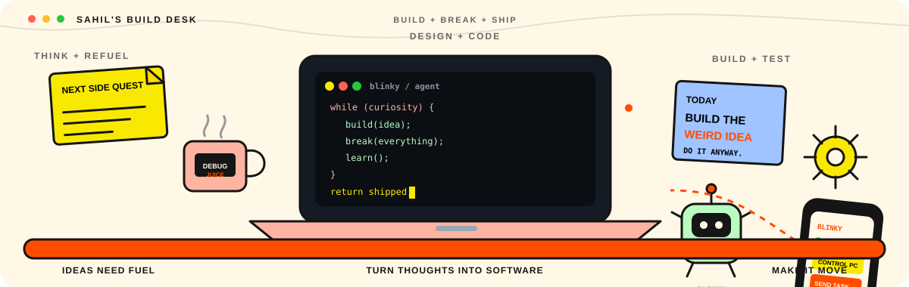
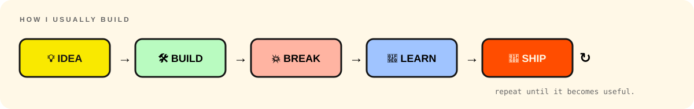

  

 

**B.Tech CSE @ GNDU · Amritsar · building in public**

 

---

## hi, i'm sahil 👋

I build **AI tools, desktop automation, full-stack products, and random ideas that get way too ambitious**.

My main obsession right now is **[Blinky](https://github.com/KingSahil/Blinky)** — an AI tutor + your PC on autopilot that can see the screen and do tasks for you.

The goal is simple:

> make computers feel a little more like they understand what you're trying to do.

---

---

## the blinky thing

Blinky started as a desktop AI idea and kept growing until it became a full system:

`screen understanding` · `computer use` · `voice` · `video editing` · `web research` · `android companion`

The part that still makes me go **"wait, this actually works"**:

**phone → Blinky → PC / IDE**

I can send a task from the companion app and use Blinky to control my computer remotely, including IDE workflows.

[GitHub ↗](https://github.com/KingSahil/Blinky) · [Website ↗](https://blinkyy.vercel.app) · [Demo ↗](https://youtu.be/CHFF9J_Jqgw)

---

---

## things i've built

### 🧠 [Blinky](https://github.com/KingSahil/Blinky)
AI tutor + PC autopilot. Screen-aware guidance, computer use, voice, video editing, remote control.

### 📡 [SIGMA](https://github.com/KingSahil/SIGMA)
IQ/WAV signal intelligence: parameter extraction, modulation detection, demodulation and DSP.

### 🧪 [HiringMates](https://github.com/KingSahil/hiringmates)
A technical hiring and assessment platform with proctoring, anti-cheat systems and multiplayer coding.

### 🛒 KiranaKeeper
Retail + WhatsApp commerce for small shops: inventory, orders and udhaar.

<b>more side quests ↘</b>

[GNDU Attendance System](https://gndu.vercel.app/) ·
[the-science-lab](https://github.com/KingSahil/the-science-lab) ·
[HandCam Fire](https://github.com/KingSahil/handcam-fire) ·
[ShikshaFlow](https://github.com/KingSahil/shikshaflow)

and a frankly unnecessary number of smaller experiments.

---

## stuff i use

`C++` `Python` `TypeScript` `Rust`  
`React` `Next.js` `React Native` `Tauri`  
`Node.js` `FastAPI` `Firebase` `PostgreSQL`  
`FFmpeg` `GNU Radio` `Docker` `Linux`

Mostly interested in the messy intersection of **AI + software + systems + automation**.

---

## rn

~~~yaml
building:      Blinky
learning:      DSA + system design + systems
obsessing:     desktop agents
breaking:      Linux / Wayland
goal:          build bigger things and ship faster
~~~

---

## beyond code

I run technical sessions, build with hackathon teams, and make coding/tech content.

Basically:

**learn → build → break → fix → ship → repeat**

 

<a href="https://github.com/KingSahil/Blinky">Blinky</a>
&nbsp;·&nbsp;
<a href="https://sahilfolio.tech/">Portfolio</a>
&nbsp;·&nbsp;
<a href="https://www.linkedin.com/in/kingsahil">LinkedIn</a>
&nbsp;·&nbsp;
<a href="https://www.youtube.com/godsahil">YouTube</a>

  

whatever sounds fun enough to break.

