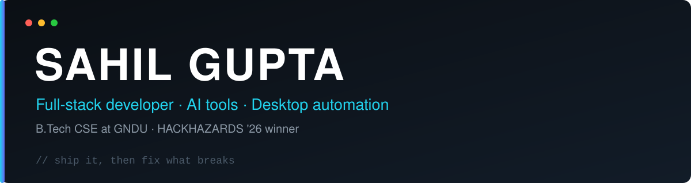
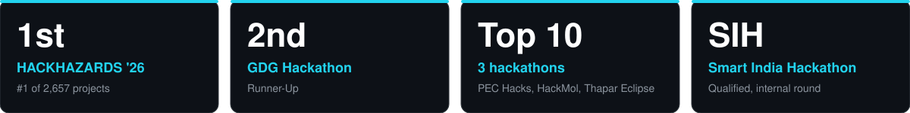
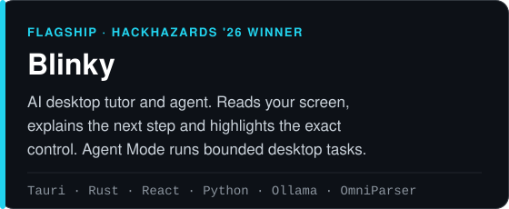
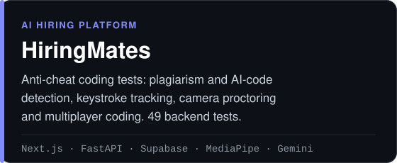
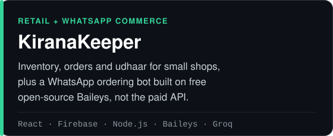
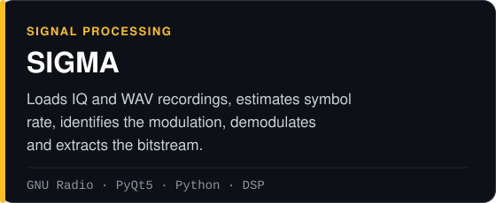

<div align="center">



<br/>

<a href="https://www.linkedin.com/in/kingsahil">LinkedIn</a>
&nbsp;·&nbsp;
<a href="https://sahilfolio.tech/">Portfolio</a>
&nbsp;·&nbsp;
<a href="https://leetcode.com/u/ProSahil/">LeetCode</a>
&nbsp;·&nbsp;
<a href="https://www.youtube.com/godsahil">YouTube</a>
&nbsp;·&nbsp;
<a href="https://x.com/Sahil317405">X</a>
&nbsp;·&nbsp;
<a href="https://www.instagram.com/supreme__sahil">Instagram</a>

</div>

<br/>

## About

I am a B.Tech Computer Science student at GNDU, Amritsar. I build AI tools and full-stack products, and I like doing it end to end: the interface, the backend, and the part where it breaks and I have to fix it.

My biggest project is **[Blinky](https://github.com/KingSahil/Blinky)**, an AI desktop tutor and agent that won **HACKHAZARDS '26** and ranked #1 among 2,657 projects.

**Looking for:** SDE roles and desktop automation roles.

<br/>

## Results



<br/>

## Selected work

<table>
<tr>
<td width="50%" valign="top">

<a href="https://github.com/KingSahil/Blinky"></a>

<a href="https://github.com/KingSahil/Blinky">GitHub</a> · <a href="https://blinkyy.vercel.app">Live</a>

</td>
<td width="50%" valign="top">

<a href="https://github.com/KingSahil/hiringmates"></a>

<a href="https://github.com/KingSahil/hiringmates">GitHub</a> · <a href="https://hiringmates.vercel.app/">Live</a>

</td>
</tr>
<tr>
<td width="50%" valign="top">

<a href="https://github.com/KingSahil/shopOS"></a>

<a href="https://github.com/KingSahil/shopOS">GitHub</a> · <a href="https://kiranakeeper.web.app/">Live</a>

</td>
<td width="50%" valign="top">

<a href="https://github.com/KingSahil/SIGMA"></a>

<a href="https://github.com/KingSahil/SIGMA">GitHub</a>

</td>
</tr>
</table>

**Also built:** [Smart Attendance](https://gndu.vercel.app/), a geo-validated attendance system on Firebase that cut proxy attendance by 40% · [the-science-lab](https://github.com/KingSahil/the-science-lab), Godot physics and shader experiments · [meowcare](https://github.com/KingSahil/meowcare), a medicine reminder app for older people that eases caretaker burnout

<br/>

## Toolbox

| | |
|:---|:---|
| **Languages** | C · C++ · Python · JavaScript · TypeScript · Rust |
| **Frontend** | React · Next.js · React Native · Tailwind CSS |
| **Backend** | Node.js · Express · FastAPI · Flask · REST APIs · WebSockets |
| **AI and systems** | LLMs · Computer Vision · OCR · Desktop Automation · GNU Radio · DSP |
| **Data** | SQL · PostgreSQL · MongoDB · MySQL · Firestore · Supabase |
| **Tools** | Git · Docker · Vercel · Linux |
| **Core** | Data Structures and Algorithms (LeetCode) · Problem Solving |

<br/>

## Beyond the code

- Community Lead at **Tech Nerds Community** (GNDU): technical sessions, workshops and peer learning.
- Core team at **Tech Titans** (GNDU): hackathon prototypes under tight deadlines.
- Creator at **Immersive EdTech Content Creation**: short videos on coding and tech concepts for Instagram and YouTube Shorts.

<br/>

## Currently

```yaml
building:
  - Blinky
  - AI tools and desktop automation

learning:
  - data structures and algorithms
  - system design
  - scalable backend systems

next:
  - win bigger hackathons
  - land an SDE role
```

<br/>

<div align="center">

<picture>
  <source media="(prefers-color-scheme: dark)" srcset="https://github-readme-stats.vercel.app/api?username=KingSahil&show_icons=true&hide_border=true&theme=transparent&title_color=22D3EE&icon_color=22D3EE&text_color=9AA7B4&bg_color=00000000">
  
</picture>

<br/><br/>

<sub>Ideas are cheap. Shipping is everything.</sub>

</div>
