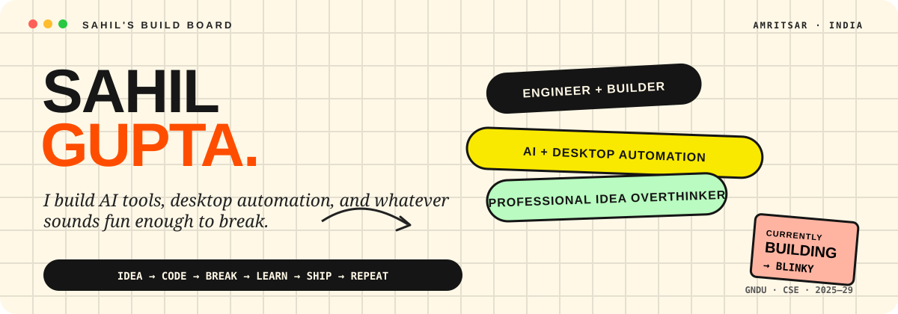

 

<a href="https://github.com/KingSahil">GitHub</a>
&nbsp;·&nbsp;
<a href="https://www.linkedin.com/in/kingsahil">LinkedIn</a>
&nbsp;·&nbsp;
<a href="https://sahilfolio.tech/">Portfolio</a>
&nbsp;·&nbsp;
<a href="https://www.youtube.com/godsahil">YouTube</a>
&nbsp;·&nbsp;
<a href="https://x.com/Sahil317405">X</a>
&nbsp;·&nbsp;
<a href="https://www.instagram.com/supreme__sahil">Instagram</a>

 

> B.Tech CSE @ GNDU  
> I build stuff end to end — and then find out why it broke.

## what i'm about

I'm Sahil. I like building **AI tools, desktop automation, full-stack products, and random ideas that get way too ambitious**.

The project I'm most obsessed with right now is **[Blinky](https://github.com/KingSahil/Blinky)** — an AI tutor + your PC on autopilot that can see your screen and do tasks for you.

And yeah, it got a little out of hand.

## proof i actually ship

### 🏆 HACKHAZARDS '26
**1st place · 2,657 projects**

[View Blinky →](https://github.com/KingSahil/Blinky)

Not just another weekend demo. Blinky became a full desktop + mobile system with screen understanding, computer use, voice, video editing, remote control, and an IDE bridge.

## currently building

### Blinky

**AI tutor + your PC on autopilot.**

It can see what's on your screen, understand what you're trying to do, explain it, highlight the right thing, and — when you ask — actually do it.

The bit I care about most:

**phone → Blinky → PC / IDE**

I can send a task from the companion app and control my desktop remotely, including IDE workflows.

~~~mermaid
flowchart LR
    P["📱 Phone"] -->|"authenticated connection"| B["⚡ Blinky"]
    B --> V["👁️ See the screen"]
    V --> R["🧠 Reason about context"]
    R --> A["🖱️ Act on the PC"]
    A --> I["💻 IDE / Apps"]
~~~

[GitHub](https://github.com/KingSahil/Blinky) · [Website](https://blinkyy.vercel.app) · [Demo](https://youtu.be/CHFF9J_Jqgw)

## stuff i've built

**Blinky** — AI desktop tutoring, computer use, voice, video editing, remote PC control.

**SIGMA** — IQ/WAV signal analysis, modulation identification, demodulation, and DSP workflows.

**HiringMates** — technical hiring and assessment platform with proctoring and anti-cheat systems.

**KiranaKeeper** — inventory, orders, udhaar, and WhatsApp commerce for small retailers.

more side quests ↘

- [GNDU Attendance System](https://gndu.vercel.app/) — attendance system I built around real campus constraints.
- [the-science-lab](https://github.com/KingSahil/the-science-lab) — Godot physics and shader experiments.
- [HandCam Fire](https://github.com/KingSahil/handcam-fire) — computer-vision experiment.
- [ShikshaFlow](https://github.com/KingSahil/shikshaflow) — gamified education experiment.
- A bunch of smaller things that probably should have been side projects and somehow became repositories.

## things i use

`C++` `Python` `TypeScript` `Rust`  
`React` `Next.js` `React Native` `Tauri`  
`Node.js` `FastAPI` `Firebase` `PostgreSQL`  
`FFmpeg` `GNU Radio` `Docker` `Linux`

Mostly interested in the messy intersection of **AI + software + systems + automation**.

## rn

~~~yaml
building:    Blinky
learning:    DSA + system design + systems
obsessing:   desktop agents
breaking:    Linux / Wayland things
goal:        build bigger things, ship faster, keep learning
~~~

## beyond code

I also run technical sessions, build with hackathon teams, and make coding/tech content.

Basically:

**learn something → build it → break it → fix it → show it to people**

 

<a href="https://github.com/KingSahil/Blinky">Blinky</a>
&nbsp;·&nbsp;
<a href="https://sahilfolio.tech/">Portfolio</a>
&nbsp;·&nbsp;
<a href="https://www.linkedin.com/in/kingsahil">LinkedIn</a>

  

ship it → break it → learn it → ship it again

